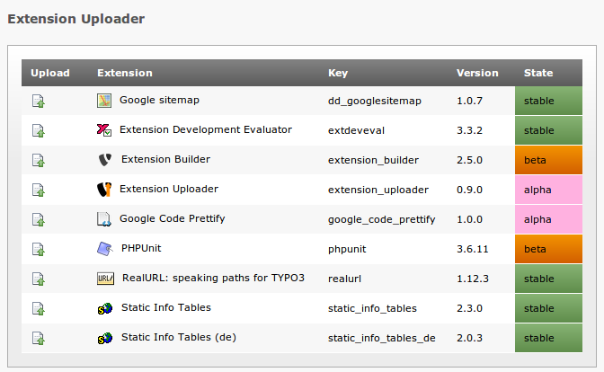

==================
Extension Uploader
==================

:Extension name: Extension Uploader
:Extension key: extension_uploader
:Version: 1.0.8
:Description: manuals covering the TYPO3 CMS extension "Extension Uploader"
:Language: en
:Author: Georg Großberger
:Creation: 2013-02-10
:Generation: 14:15
:Licence: Open Content License available from `www.opencontent.org/opl.shtml <http://www.opencontent.org/opl.shtml>`_

The content of this document is related to TYPO3, a GNU/GPL CMS/Framework available from `www.typo3.org
<http://www.typo3.org/>`_

**Table of Contents**

.. toctree::
	:maxdepth: 2

	Usage
	License

.. include:: ../Readme.rst

		Easy upload with a familiar interface
