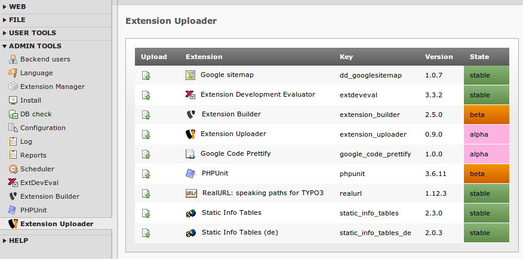
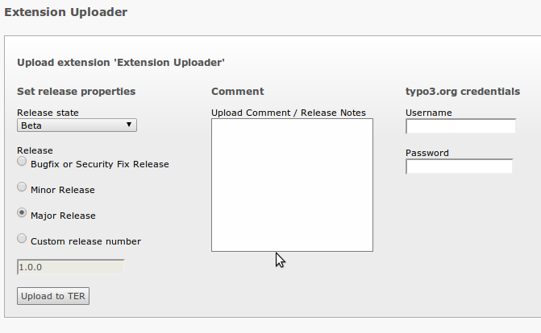

=======================
Useage of the extension
=======================

How to upload an extension into the TER

Target group: **Developers**

=============================
Upload via the Backend Module
=============================

Select an extension
-------------------

Go into the module **Extension Builder** which is found inside the **Admin Tools** section.

There click the upload icon on the left in the row that displays the extension you want to upload.

		Click upload on the left of the extension to upload

Set release information
-----------------------

In the settings form you can set several settings. The default settings are alright, only the fields for **Username** and **Password** are mandatory since this credentials are needed to authenticate at the TER.

Once you set everything, click the **Upload to TER** button to perform the upload

The settings in detail:

.. ..................................
.. container:: table-row

	Field
		Release state

	Description
		The state or stability of the release

	Options
		Only the displayed Options are available:
		* Stable - for mature extension
		* Beta - not sure if yet mature, but quite
		* Alpha - still in development
		* Experimental - not meant for production, a prove of concept or something similar
		* Test - Just a test
		* Obsolete - Last release of an extension, indicator that it is not maintained anymore

	Mandatory
		Yes - but set by default

	Default
		The last release state, alpha for new extensions

.. ..................................
.. container:: table-row

	Field
		Release

	Description
		The type of release, which will used to determine the version number of the release

	Options
		* Bugfix - For bugfixes, security fixes or setting a new extension state
		* Minor - Indicates new features or changes to existing ones
		* Major - Important, breaking changes. Maybe even a whole rewrite
		* Custom - Just set a custom version number

	Mandatory
		Yes - but set by default

	Default
		Bugfix

.. ..................................
.. container:: table-row

	Field
		Upload comment

	Description
		A short upload comment, like release notes or other important information.

	Options
		Any text

	Mandatory
		No

	Default
		Empty

.. ..................................
.. container:: table-row

	Field
		Target Repository

	Description
		The repository to upload to. By default, only one (typo3.org) is available

	Options
		Repository domain models of the Extension Manager

	Mandatory
		Yes - but set by default

	Default
		typo3.org

.. ..................................
.. container:: table-row

	Field
		Username / Password

	Description
		Your username and password for the selected TER, by default typo3.org. You must have registered the extension key with this account for uploading it.

	Options
		Text

	Mandatory
		Yes

	Default
		Empty

		Set username and password and hit *Upload* to release your extension

==============
Upload via CLI
==============

As an alternative, an extbase command is available via a shell that supports TYPO3's command line API. It is well documented and can be used easily.

There are four mandatory commands

* --release OR --version
* extensionkey
* TYPO3.org username
* TYPO3.org password

.. note::
	Unlike the Backend module, the CLI (currently) only supports uploads to the typo3.org repository.

To display the help just type

.. code-block:: none

	./typo3/cli_dispatch.phpsh extbase help uploader:upload

As mentioned above, the release ('bugfix', 'minor', 'major') or the version must be set.
So those two are both valid commands:

Release a minor version:

.. code-block:: none

	./typo3/cli_dispatch.phpsh extbase uploader:upload --release=minor --comment="New features" my_extension my_user my_password

Release a specific version:

.. code-block:: none

	./typo3/cli_dispatch.phpsh extbase uploader:upload --version=1.2.3 --comment="Skip some versions" my_extension my_user my_password
